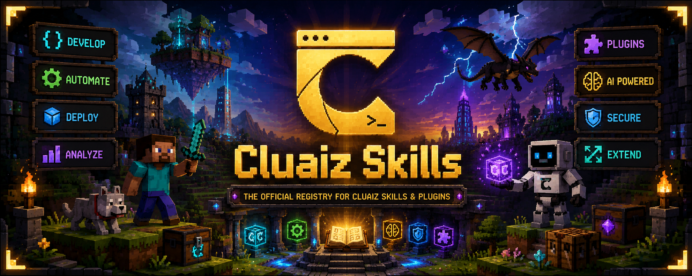
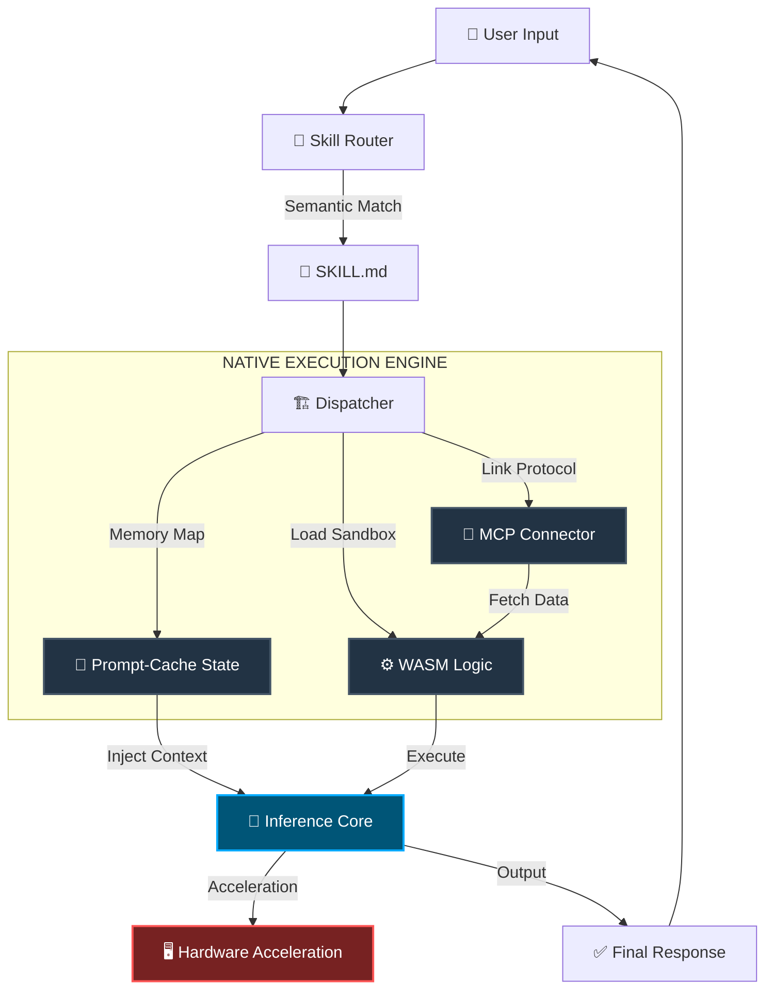

<p align="center">
  
</p>

<h1 align="center">Cluaiz Skills</h1>

<p align="center">
  <strong>The Official Registry for Cluaiz Skills & Plugins.</strong>
</p>

<p align="center">
  <a href="https://github.com/cluaiz/skills/actions"></a>
  <a href="LICENSE"></a>
</p>

<p align="center">
  <a href="doc/overview.md">Overview</a> ·
  <a href="doc/skill-format.md">Skill Format</a> ·
  <a href="doc/quickstart.md">Quickstart</a> ·
  <a href="doc/contributing.md">Contributing</a>
</p>

---

## What is this?

This repository is the central registry for **skills** and **plugins** that extend the Cluaiz Agent. Each skill is a folder containing a `SKILL.md` file — a single document that serves as both machine-readable metadata and the agent's system prompt.

Skills can optionally include native execution binaries (`.wasm`), persistent memory (`.prompt-cache`), helper scripts, MCP connectors, and configuration files — all linked directly from the `SKILL.md`.

## Repository structure

```
cluaiz-skills/
├── skills/                      # All skills, organized by category
│   ├── dev-suite/               # Development tools
│   ├── productivity/            # Document processing, scheduling
│   └── ...
│
├── plugins/                     # All plugins, organized by category
│   ├── search-engines/          # Web search connectors
│   ├── databases/               # Database integrations
│   └── ...
│
├── souls/                       # Core personas and behavior bundles
│   ├── hacker/                  # Example soul identity
│   │   └── SOUL.md              
│   └── ...
│
├── doc/                         # Documentation
│   ├── overview.md              # Skills vs Plugins vs Souls
│   ├── skill-format.md          # SKILL.md spec, frontmatter, linking
│   ├── plugin-format.md         # Plugin connectors, MCP, APIs
│   ├── soul-format.md           # SOUL.md format and identity mapping
│   ├── quickstart.md            # Create your first skill
│   ├── cli.md                   # CLI reference
│   └── contributing.md          # PR rules, review process
│
├── scripts/                     # Registry build automation
├── .github/                     # CI/CD workflows
├── registry.json                # Auto-generated skill index
├── LICENSE                      # MIT
└── README.md                    # This file
```

## How it works



Every skill operates on a **Triple-Tier Architecture**:

| Tier | File | Purpose |
|---|---|---|
| 🧠 **State** | `state.prompt-cache` | Persistent memory. Pre-computed context injected directly into the model's forward pass. Zero token tax. |
| ⚙️ **Logic** | `logic.wasm` | Native execution. WebAssembly binary running at near-C++ speed inside a secure sandbox. |
| 🤝 **Protocol** | `connector.json` | External bridge. MCP/API connectors linking the sandbox to databases, APIs, and services. |

## Quick start

```bash
# Install a skill
cluaiz skill install <name>

# Search for skills
cluaiz skill search "pdf"

# List installed skills
cluaiz skill list

# Update all
cluaiz skill update --all
```

## Create a skill

Create a folder, write a `SKILL.md`, done.

```bash
mkdir -p skills/productivity/my-skill
```

```markdown
---
name: my-skill
version: 1.0.0
description: Summarize documents into bullet points.
permissions:
  filesystem: true
  network: false
  level: ReadOnly
triggers:
  semantic: [summarize, bullet-points]
---

# Skill: Document Summarizer

You are equipped with the Document Summarizer skill...
```

See [Quickstart](doc/quickstart.md) for the full walkthrough and [Skill Format](doc/skill-format.md) for the complete reference.

## Documentation

| Doc | What it covers |
|---|---|
| [Overview](doc/overview.md) | Skills vs Plugins vs Souls, repo structure, how it works |
| [Skill Format](doc/skill-format.md) | SKILL.md spec, YAML frontmatter, asset linking, agent prompt rules |
| [Plugin Format](doc/plugin-format.md) | MCP connectors, API bridges, env vars |
| [Soul Format](doc/soul-format.md) | SOUL.md spec, core agent identities and personas |
| [Quickstart](doc/quickstart.md) | Create your first skill in 5 minutes |
| [CLI](doc/cli.md) | `cluaiz skill` command reference |
| [Contributing](doc/contributing.md) | PR requirements, naming, review process |

## License

[MIT](LICENSE) © 2026 Cluaiz Technologies
